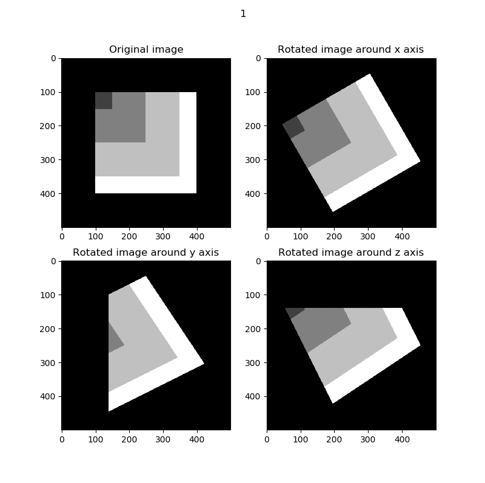

This is a rotation function for 3D tensor/array data, which may be useful for 3d registration or 3d data enhancement. Based on [torchvision.transforms.functional.rotate](http://pytorch.org/vision/main/generated/torchvision.transforms.functional.rotate.html), it can rotate the data quickly on GPU/CPU. When the tensor is large, try to use GPU to accelerate the rotation operation..

# Requirement
- torchvision >= 0.9.1
- torch
- numpy

# Details
## Platform
- Windows 10
## Hardware
- GPU: NVIDIA Geforce RTX 3060 (LAPTOP) (6GB)
- CPU: Intel(R) Core(TM) i5-11400H @ 2.70 GHz

# Rotation Result Sample

# Consuming Time Conparison
| Device | Size | Axis |Theta | Consuming Time (s) |
| ------ | ------ | ------ | ------ | ------ |
| GPU | 10 * 10 * 10 | 0 | 30 | 0.567 |
| CPU | 10 * 10 * 10 | 0 | 30 | 0.001 |
| GPU | 50 * 50 * 50 | 0 | 30 | 0.558 |
| CPU | 50 * 50 * 50 | 0 | 30 | 0.003 |
| GPU | 200 * 200 * 200 | 0 | 30 | 0.571 |
| CPU | 200 * 200 * 200 | 0 | 30 | 0.096 |
| GPU | 500 * 500 * 500 | 0 | 30 | 0.621 |
| CPU | 500 * 500 * 500 | 0 | 30 | 2.053 |
| GPU | 600 * 600 * 600 | 0 | 30 | 0.682 |
| CPU | 600 * 600 * 600 | 0 | 30 | 3.704 |
| GPU | 800 * 800 * 800 | 0 | 30 | out of memory |
| CPU | 800 * 800 * 800 | 0 | 30 | 11.98 |
